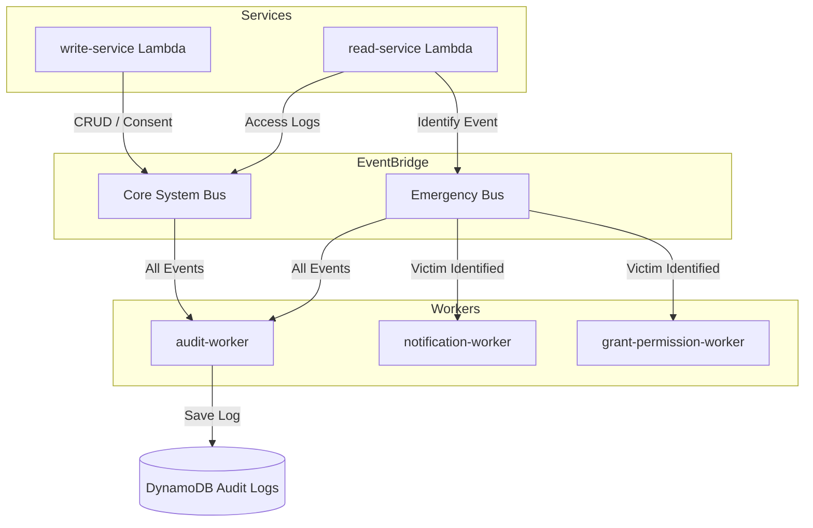

# HelpMe System Design (Emergency Response System)

> **Status:** This document describes the **as-built** architecture in `help_me_backend`.
> The backend was migrated from an earlier **Go + ECS Fargate** design to **TypeScript AWS Lambdas**; the Python AI service remains on ECS. Where the intended end-state and the current code differ, it is called out explicitly under **Migration status** (§7).

---

## 1. Architecture style

**Serverless, event-driven.** A synchronous request path (API Gateway → Lambda) handles reads/writes, and an asynchronous **dual-bus** EventBridge backbone separates operational/compliance events from emergency-response events.

* **Compute:** AWS Lambda (API + async workers, TypeScript); Amazon ECS Fargate (Python AI service only).
* **API protocol:** REST over HTTP, fronted by **API Gateway v2 (HTTP API)**. Lambda handlers use `itty-router`.
* **Event backbone:** Amazon EventBridge — two separate buses (system + emergency).
* **Identity:** AWS Cognito (User Pool + Groups; federated Google sign-in).

---

## 2. Synchronous request path

```
Flutter app ──JWT──▶ API Gateway v2 ──▶ Lambda Authorizer ──▶ read-service / write-service Lambda ──▶ Postgres
                                              │                         └──▶ AI service (face embedding)
                                              └── injects { userId, role }
```

* **Lambda Authorizer** (`src/functions/authorizer`) verifies the Cognito JWT (`aws-jwt-verify`), derives `role` from `cognito:groups` (`citizen` | `staff` | `admin`), and injects `{ userId, role }` into the request context. A `publicPaths` whitelist (`/signin`, `/user/verify`, `/user/search`, `/user/register`, `/health`) bypasses auth.
* **read-service** (`src/functions/read-service`): GET profile / medical record / NFC tags; staff & admin identification lookups.
* **write-service** (`src/functions/write-service`): PUT profile & medical record; POST face registration; POST NFC registration.
* Handlers read auth via `getAuthContext(event)` and enforce access with `requireRole([...])` (see `src/utils/router.ts`).

---

## 3. Data & storage layer

| Component | Technology | Purpose |
| :--- | :--- | :--- |
| **Relational DB** | **Single managed Supabase Postgres** (local Docker for dev) via **Drizzle ORM** | All business data + vector search |
| **Face vectors** | `pgvector` (512-dim column on `citizens`) | Face-embedding similarity matching |
| **Audit / sessions** | DynamoDB *(provisioned in Terraform)* | Centralized audit trail & access sessions |

The relational layer is **exclusively Supabase** — accessed over the standard Postgres wire via `DATABASE_URL` (Terraform `supabase_db_url`). The earlier RDS module has been removed; there is no second Postgres instance. DynamoDB is intentionally kept for the audit trail and grant-permission sessions only (see §6).

### Schema (`help_me_backend/src/db/schema.ts`)
Identity is split across three tables — `citizens`, `staff`, `admins` — for security/performance isolation. Supporting tables:

* `citizens` — identity + `cccdNumber` (national ID) + `faceEmbedding` (pgvector 512) + `emergencyContacts` (JSONB).
* `medical_records` — 1:1 with a citizen (blood group, allergies, background diseases, medications, distinguishing marks, notes).
* `nfc_tags`, `qr_codes` — each with `status` (ACTIVE/INACTIVE), `citizen_id` owner, `last_used_at`.
* `emergency_reports` — reporter (staff) + victim (citizen) + location + status.

---

## 4. Identification methods

Three complementary paths resolve to a `citizens` record:

1. **Face (priority #1)** — image → AI service → **EdgeFace 512-d embedding** → vector similarity against stored `faceEmbedding`.
2. **NFC tag** — for the unconscious, when face capture fails.
3. **QR code** — printed fallback (helmets/vehicles).

### NFC / QR hash rule (security-critical)
The value written to a tag is an **HMAC-SHA256 of the citizen id under `SYSTEM_SECRET`** (`src/services/hash.service.ts`). **The hash id is never stored in any table.** Identification: look up the NFC/QR row by tag id → if `status = INACTIVE`, return nothing → if `ACTIVE`, recompute the hash from `citizen_id` and compare with `timingSafeEqual`; only on match return the citizen's info.

---

## 5. AI processing (`help_me_backend/src/functions/ai-service`)

Python **FastAPI** service (mirrors `help_me_ai_face_poc`), deployed on **ECS Fargate**, gated by an `X-HelpMe-Secret` header.

Pipeline: **MediaPipe** face validation → **Silent-Face anti-spoofing** (liveness) → **EdgeFace** 512-d embedding. Endpoints: `POST /extract` (returns the embedding), `GET /health`. Vendored model folders (`anti_spoofing/`, `edgeface/`, `face_landmark/`) are treated as read-only.

---

## 6. Asynchronous dual-bus event flow

Two EventBridge buses keep the compliance data flow separate from the emergency operations flow.

* **Core System Bus** — compliance & auditing: consent logging, medical-record CRUD logs, "which staff viewed whose record, when".
* **Emergency Bus** — operations: identification events, orchestration (notify next-of-kin, grant staff fast-access).



**Design intent:** operational workers (e.g. Notification) never receive Core-Bus events, limiting data-access scope; the Audit Worker consolidates both buses into one DynamoDB table for a single admin-queryable view.

New citizens are provisioned by a Cognito **post-confirmation** Lambda trigger, which assigns the `Citizens` group and inserts the `citizens` row.

---

## 7. Migration status (current gaps)

The as-built system is **mid-migration**; the following are not yet reconciled:

1. **Deploy tooling is stale.** `deploy.yml`, `scripts/deploy.ps1`, and `LOCAL_TESTING.md` still build the retired **Go binaries + ECS Docker images** (`src/cmd/*`, `src_go_archive/`). No end-to-end pipeline currently packages the live TypeScript Lambdas (`node build.js` → `dist/`).
2. **AI invocation seam.** `write/read-service` call the AI service via **Lambda invoke** (`AI_LAMBDA_NAME`), but the AI service is deployed as a **FastAPI/ECS** endpoint. Only one path is live.
3. **ECS being retired** — the remaining ECS container-image inputs in `infra/main.tf` are hard-coded `"DEPRECATED"`; the target end-state is Lambda-only except for the Python AI workload. (The relational-DB side is already clean: the RDS module and `db_password`/`db_cluster_endpoint` plumbing have been removed — Supabase is the sole relational store.)
4. **Async workers are stubs** — `audit-worker`, `notification-worker`, `grant-permission-worker` are wired to EventBridge but largely unimplemented; DynamoDB audit/session tables exist in Terraform but are not yet written to from the TS code.

---

## 8. Security & compliance

* **Sensitive-data compliance:** targets Decree 13/2023/NĐ-CP (protection of sensitive personal data).
* **Role-based access:** enforced at the authorizer (JWT/group) and per-route via `requireRole`.
* **Bus isolation:** dual-bus design bounds which workers can see which data.
* **Hash-id secrecy:** citizen hash ids are computed on demand and never persisted (§4).
