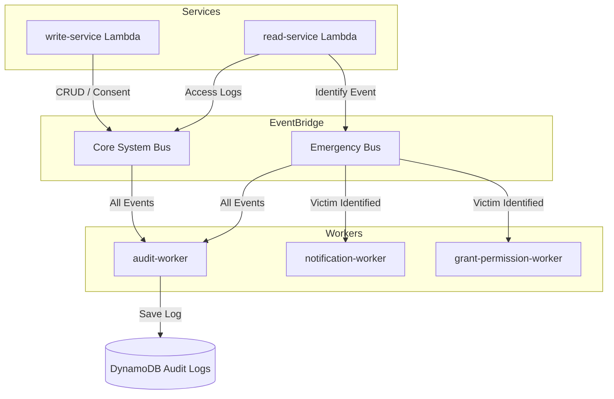

# HelpMe System Design (Emergency Response System)

> **Status:** This document describes the **as-built** architecture in `help_me_backend`.
> The backend was migrated from an earlier **Go + ECS Fargate** design to **TypeScript AWS Lambdas**, with the Python AI service as a **container-image Lambda**. Nothing runs on ECS anymore. Remaining leftovers are called out under **Migration status** (§7).

---

## 1. Architecture style

**Serverless, event-driven.** A synchronous request path (API Gateway → Lambda) handles reads/writes, and an asynchronous **dual-bus** EventBridge backbone separates operational/compliance events from emergency-response events.

* **Compute:** AWS Lambda everywhere — TypeScript (zip) Lambdas for the API + async workers, and a Python **container-image** Lambda for the AI service.
* **API protocol:** REST over HTTP, fronted by **API Gateway v2 (HTTP API)**. Lambda handlers use `itty-router`.
* **Event backbone:** Amazon EventBridge — two separate buses (system + emergency).
* **Identity:** AWS Cognito (User Pool + Groups; federated Google sign-in).

---

## 2. Synchronous request path

```
Flutter app ──JWT──▶ API Gateway v2 ──▶ Lambda Authorizer ──▶ read-service / write-service Lambda ──▶ Postgres
                                              │                         └──▶ AI service (face embedding)
                                              └── injects { userId, role }
```

* **Lambda Authorizer** (`src/functions/authorizer`) verifies the Cognito JWT (`aws-jwt-verify`), derives `role` from `cognito:groups` (`citizen` | `staff` | `admin`), and injects `{ userId, role }` into the request context. A `publicPaths` whitelist (`/signin`, `/user/verify`, `/user/search`, `/user/register`, `/health`) bypasses auth.
* **read-service** (`src/functions/read-service`): GET profile / medical record / NFC tags; staff & admin identification lookups (`POST /read/scan`); session-gated victim re-access (`GET /read/victim/:victimId`).
* **write-service** (`src/functions/write-service`): PUT profile & medical record; POST face registration; POST NFC registration.
* Handlers read auth via `getAuthContext(event)` and enforce access with `requireRole([...])` (see `src/utils/router.ts`).

---

## 3. Data & storage layer

| Component | Technology | Purpose |
| :--- | :--- | :--- |
| **Relational DB** | **Single managed Supabase Postgres** (local Docker for dev) via **Drizzle ORM** | All business data + vector search |
| **Face vectors** | `pgvector` (512-dim column on `citizens`) | Face-embedding similarity matching |
| **Audit / sessions** | DynamoDB *(provisioned in Terraform)* | Centralized audit trail & access sessions |

The relational layer is **exclusively Supabase** — accessed over the standard Postgres wire via `DATABASE_URL` (Terraform `supabase_db_url`). The earlier RDS module has been removed; there is no second Postgres instance. DynamoDB is intentionally kept for the audit trail and grant-permission sessions only (see §6).

### Schema (`help_me_backend/src/db/schema.ts`)
Identity is split across three tables — `citizens`, `staff`, `admins` — for security/performance isolation. Supporting tables:

* `citizens` — identity + `cccdNumber` (national ID) + `faceEmbedding` (pgvector 512) + `emergencyContacts` (JSONB).
* `medical_records` — 1:1 with a citizen (blood group, allergies, background diseases, medications, distinguishing marks, notes).
* `nfc_tags`, `qr_codes` — each with `status` (ACTIVE/INACTIVE), `citizen_id` owner, `last_used_at`.
* `emergency_reports` — reporter (staff) + victim (citizen) + location + status.

---

## 4. Identification methods

Three complementary paths resolve to a `citizens` record:

1. **Face (priority #1)** — image → AI service → **EdgeFace 512-d embedding** → vector similarity against stored `faceEmbedding`.
2. **NFC tag** — for the unconscious, when face capture fails.
3. **QR code** — printed fallback (helmets/vehicles).

### NFC / QR hash rule (security-critical)
The value written to a tag is an **HMAC-SHA256 of the citizen id under `SYSTEM_SECRET`** (`src/services/hash.service.ts`). **The hash id is never stored in any table.** Identification: look up the NFC/QR row by tag id → if `status = INACTIVE`, return nothing → if `ACTIVE`, recompute the hash from `citizen_id` and compare with `timingSafeEqual`; only on match return the citizen's info.

---

## 5. AI processing (`help_me_backend/src/functions/ai-service`)

A Python **container-image Lambda** (ported from `help_me_ai_face_poc`): base `public.ecr.aws/lambda/python:3.12`, 3008 MB RAM, 30s timeout, CPU-only PyTorch. Entrypoint `app.lambda_handler` receives `{ "image": "<base64>" }` (or `{ "is_warmup": true }`) and returns `{ success, embedding }` (512 floats). It is invoked directly by the read/write-service Lambdas via the AWS SDK (`AI_LAMBDA_NAME`).

Pipeline (`regconition_original.py` → `FaceProcessor.process_image`): **MediaPipe FaceLandmarker** face detection + quality gate (yaw/pitch ≤ 15°, face area 10–50% of frame) → crop with 15% padding → **Silent-Face anti-spoofing** (MiniFASNetV2 liveness) → **EdgeFace** (`edgeface_s_gamma_05`) → 512-d L2-normalized embedding. Vendored model folders (`anti_spoofing/`, `edgeface/`, `face_landmark/`) are read-only.

> `main.py` (a FastAPI `/extract` variant) is **not deployed** — the Dockerfile runs `app.lambda_handler`. It is dead/alternate code.

---

## 6. Asynchronous dual-bus event flow

Two EventBridge buses keep the compliance data flow separate from the emergency operations flow.

* **Core System Bus** — compliance & auditing: consent logging, medical-record CRUD logs, "which staff viewed whose record, when".
* **Emergency Bus** — operations: identification events, orchestration (notify next-of-kin, grant staff fast-access).



**Design intent:** operational workers (e.g. Notification) never receive Core-Bus events, limiting data-access scope; the Audit Worker consolidates both buses into one DynamoDB table for a single admin-queryable view.

**Implementation.** `src/services/events.service.ts` publishes events (`source: helpme.backend`); publishing is best-effort and never breaks the caller. The read/write-service Lambdas emit:
- **System bus:** `citizen.profile.updated`, `medical_record.updated`, `citizen.face.registered`, `nfc.registered` (compliance/CRUD audit).
- **Emergency bus:** `victim.identified` on a successful staff/admin `/read/scan` (NFC or FACE), carrying `responderId`, `targetId` (victim), and `method`.

Workers (all implemented):
- **audit-worker** → writes every event (both buses) to the `audit-logs` table (`actor_id` hash / `timestamp` range = `<iso>#<eventId>`).
- **grant-permission-worker** → on `victim.identified`, writes an `access-sessions` row `session_id = <responderId>#<victimId>` with a 1-hour DynamoDB TTL (`expires_at`). This grant is **enforced** by the read-service's `GET /read/victim/:victimId` endpoint (`services/session.service.ts` → `hasActiveSession`, which re-checks `expires_at` rather than trusting TTL deletion, and fails closed on error).
- **notification-worker** → on `victim.identified`, loads the victim's `emergency_contacts` (JSONB, shape `{ name, relationship, phone, backupPhone, email }`) and alerts **every reachable channel per contact**: email via SMTP (nodemailer) and SMS via **AWS SNS** (`phone`/`backupPhone`, normalized to E.164, VN `+84` default). Phone-only contacts are no longer skipped.

New citizens are provisioned by a Cognito **post-confirmation** Lambda trigger, which assigns the `Citizens` group and inserts the `citizens` row.

---

## 7. Migration status

**Done:** control plane is TypeScript Lambdas; the AI service is a container-image Lambda (no ECS/FastAPI seam); the relational layer is a single Supabase Postgres; the async workers + dual-bus `PutEvents` wiring are implemented (§6). Deploy tooling — `scripts/deploy.ps1` (no CI) — builds the TS bundles (`node build.js` → `dist/`) and the AI container, then runs `terraform apply`. All dead pre-migration infra has been removed: the `ecs`, `bastion`, `lambda_proxy`, and `vpc` modules, the `read/write_container_image` inputs, the RDS module + `db_password`/`db_cluster_endpoint` plumbing, the Cloud Map service-discovery namespace, the ECS-scaling `cloud-start/stop.ps1` scripts, and `src_go_archive/`. Terraform now stands up **only** Lambda + API Gateway + Cognito + EventBridge + DynamoDB + S3 + Supabase (no VPC — no Lambda is VPC-attached).

**Recently resolved:**

> **Resolved (2026-07):** Emergency-contact channel. `notification-worker` no longer emails-only. It now alerts **every reachable channel** on each contact — email via SMTP **and** SMS via AWS SNS for `phone`/`backupPhone` (normalized to E.164, VN `+84` default) — so phone-only contacts are reached. The worker role gained `sns:Publish`.
>
> **Resolved (2026-07):** Session enforcement. `POST /read/scan` remains the grant trigger (identify → emit `victim.identified` → `grant-permission-worker` writes the 1-hour session). Re-access is now gated: `GET /read/victim/:victimId` calls `hasActiveSession` (fails closed, re-checks `expires_at`) and 403s without a live grant, and audits each hit via `victim.record.accessed` on the system bus.

**Operational prerequisite (SMS):** AWS SNS SMS starts in the **sandbox** (only verified numbers, capped spend). Before SMS reaches arbitrary next-of-kin in production, move the account out of the SNS SMS sandbox and set an SMS spending limit in the SNS console. Email is unaffected.

---

## 8. Security & compliance

* **Sensitive-data compliance:** targets Decree 13/2023/NĐ-CP (protection of sensitive personal data).
* **Role-based access:** enforced at the authorizer (JWT/group) and per-route via `requireRole`.
* **Bus isolation:** dual-bus design bounds which workers can see which data.
* **Hash-id secrecy:** citizen hash ids are computed on demand and never persisted (§4).
