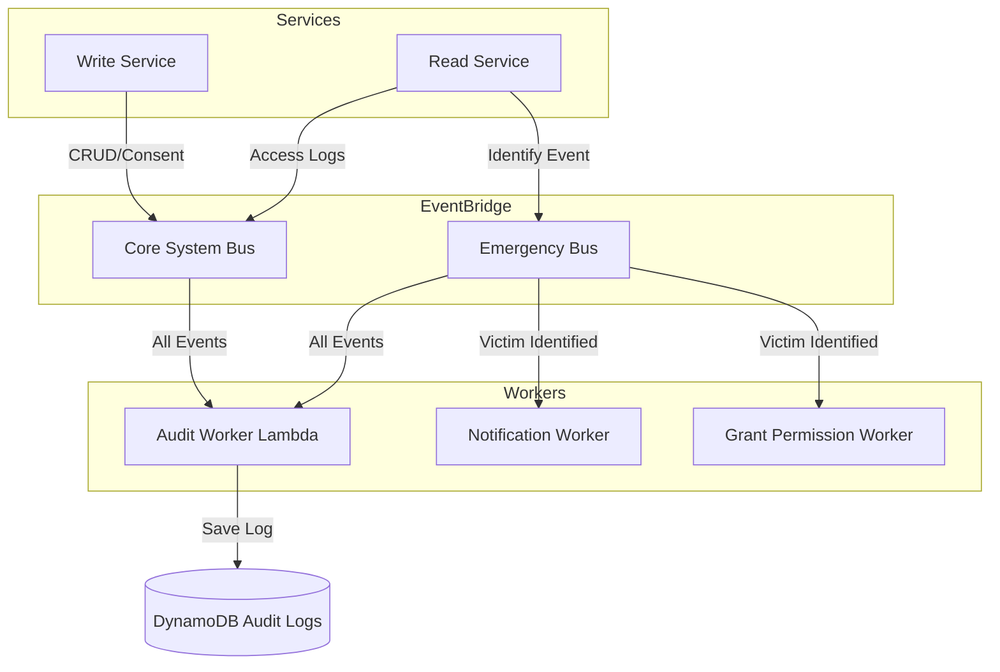

## **HelpMe System Design (Emergency Response System) — Dual-Bus Version**

### **1. Overall Architecture (Architecture Style)**
The system adopts a **Microservices** architecture combined with an **Event-Driven Architecture (EDA)**. A defining characteristic is the use of a **Dual-Bus** design to cleanly separate the operational/system data flow from the emergency-response data flow.

* **Communication Protocol:** RESTful API (Go standard net/http) over HTTP/1.1 & HTTP/2.
* **Compute:** Amazon ECS Fargate & AWS Lambda.
* **Event Backbone:** Amazon EventBridge with two separate buses.

### **2. Processing Layer**

#### **A. Core System Bus (`helpme-core-system-bus`)**
Serves **Compliance** and **Auditing** purposes:
*   **Log Consent:** Records citizens' consent when registering their profile.
*   **Data Access Logs:** Logs CRUD operations (Create, Update, Delete) on medical records.
*   **Access Audit:** Detailed logging of "which staff member viewed what, of whom, and when".

#### **B. Emergency Bus (`helpme-emergency-bus`)**
Serves emergency **Operations** purposes:
*   **Identification:** Receives Face/NFC/QR scan events (REST POST requests to `/write-service/...`).
*   **Workflow Orchestration:** Triggers automated flows (notifying next of kin, granting fast access to healthcare staff).

### **3. Data & Storage Layer**
| Component | Technology | Purpose |
| :--- | :--- | :--- |
| **Relational DB** | PostgreSQL (RDS) | 3-table structure (`citizens`, `staff`, `admins`) & vector search |
| **Audit Logs** | DynamoDB | Centralized storage of all logs from the Core & Emergency buses |
| **Session Store** | DynamoDB | Manages access sessions (Grant Permission) |

### **4. Event Flow (Dual-Bus Event Flow)**

### **5. Security & Compliance Mechanisms**
*   **Data separation:** The dual-bus design limits data access scope. Operational workers (Notification) do not need — and do not have — access to the system bus (Core Bus).
*   **Centralized Audit:** Even though the input data is separated, the Audit Worker consolidates everything into a single DynamoDB table so admins can easily query the full picture.
